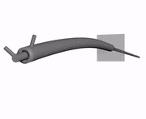

# Concentric Tube Dynamics

This repo contains code implementing the model presented in the IEEE T-RO paper "A Dynamic Model for Concentric Tube Robots".

The example uses a finite difference solution to simulate a snapping bifurcation. The code is provided <b>AS-IS</b>, with no plans for future updates.

## Prerequisites

* Qt (https://www.qt.io/download)
* Blender (https://www.blender.org/)

## License

This project is licensed under the MIT License - see the [LICENSE](LICENSE) file for details

